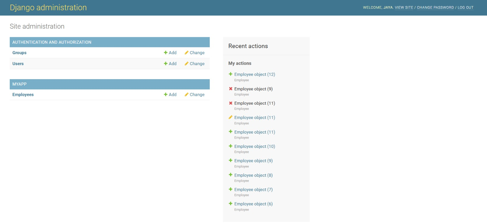
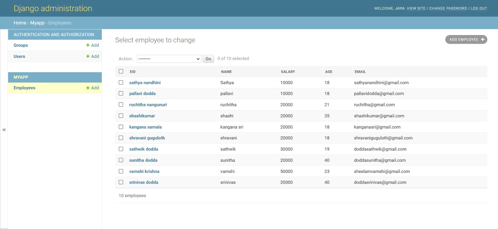

# Django ORM Web Application

## AIM

To develop a Django application to store and retrieve data from a database using Object Relational Mapping(ORM).
Entity Relationship Diagram

## Entity Relationship Diagram:

## DESIGN STEPS
## STEP 1:

Clone the problem from github
## STEP 2:

creat a new app
## STEP 3:

Enter the code for admin.py and model.py
## STEP 4:

Execute Django admin and create 10 employees
## PROGRAM:

Admin.py

from django.contrib import admin
from .models import Employee,EmployeeAdmin

Models.py

from django.db import models
class Employee(models.Model):
      Employee_id=models.CharField(max_length=8,help_text="Employee ID")
      Employee_name=models.CharField(max_length=100)
      Employee_post=models.CharField(max_length=100)
      Employee_salary=models.IntegerField()
      Employee_age=models.IntegerField()
      Employee_email=models.EmailField()

class EmployeeAdmin(admin.ModelAdmin):
    list_display=('Employee_id','Employee_name','Employee_post','Employee_salary','Employee_age','Employee_email')

## OUTPUT

## RESULT

Django application server is created successfully.